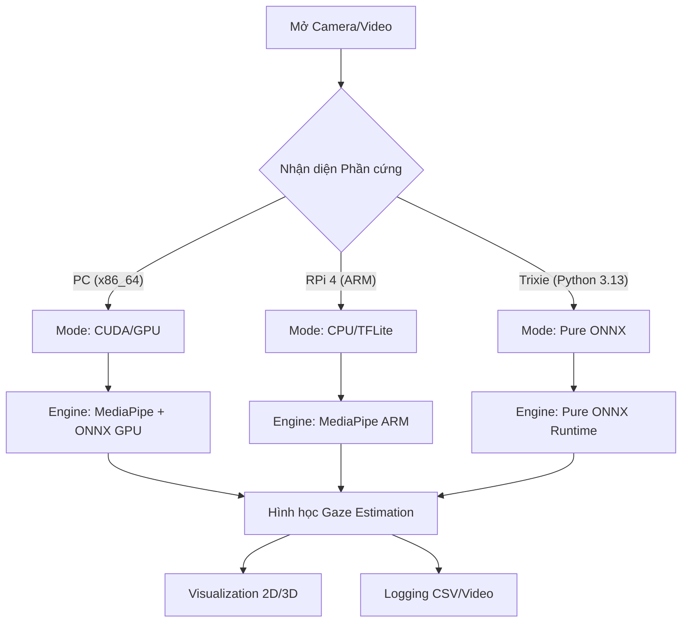

# GEOMETRIC GAZE ESTIMATION (Architecture)

## 🏗️ Tổng quan kiến trúc
Dự án được thiết kế theo mô hình **Hybrid Engine** (Engine Lai), cho phép linh động chuyển đổi giữa MediaPipe (Cực nhanh) và ONNX (Cực kỳ ổn định/Trixie) dựa trên môi trường phần cứng.

## 🧠 Sơ đồ thư viện (Dependency Map)
- **Core**: `opencv-python`, `numpy < 2.0.0`
- **Inference**: `mediapipe` (MediaPipe Engine), `onnxruntime` (ONNX Engine)
- **Math**: `scipy.optimize` (Associate logic), `filterpy.kalman` (Smoothing)
- **Analytics**: `pandas`, `plotly`, `matplotlib` (Report/3D Vis)

## 📁 Cấu trúc lưu trữ (Model Storage)
- **`models/yolov8n-face.pt`**: YOLOv8 gốc (Phục vụ xuất ONNX/PC)
- **`models/yolov8n-face.onnx`**: YOLOv8 (Inference nhanh trên Pi)
- **`models/facemesh_refined.onnx`**: FaceMesh 478 điểm (ONNX Engine)
