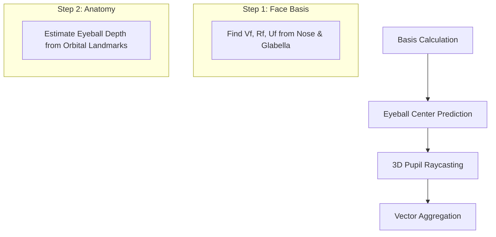

# 👁️ Geometric Gaze Estimation: Hybrid High-Performance Engine

[](https://www.python.org/downloads/)
[]()
[](https://opensource.org/licenses/MIT)

A hardcore, geometric-based gaze estimation system designed for **low-latency** and **high-accuracy** across multiple platforms. Built with a **Hybrid Inference Engine** that seamlessly switches between NVIDIA GPU (TensorRT/CUDA) and ARM CPU (MediaPipe/TFLite).

---

## 🚀 Key Highlights

- **⚡ Hybrid Inference**: Automatic hardware detection. Uses ONNX Runtime (GPU) on PC and MediaPipe (TFLite) on Raspberry Pi 4.
- **🧠 Hardcore Geometry**: 4-layer mathematical model for gaze calculation—no "black box" deep learning for vectors.
- **🎯 Multi-Face Stability**: Kalman Filter-based tracking for jitter-free ROI cropping and smooth gaze vectors.
- **📊 Interactive Visualization**: Real-time HUD, 2D geometry debug, and 3D Plotly interactive HTML models.
- **📦 1-Click Deployment**: Zero-config setup for both Windows and Linux/Debian Trixie.

---

## 🛠️ Technology Stack

| Component | Technology |
|---|---|
| **Core** | `Python`, `OpenCV`, `NumPy` |
| **Inference Models** | `YOLOv8-Face`, `MediaPipe FaceMesh (478 pts)` |
| **Engines** | `ONNX Runtime` (CUDA/CPU), `MediaPipe` |
| **Tracking/Math** | `Kalman Filter (FilterPy)`, `SciPy (Linear Assignment)` |
| **Visualization** | `Plotly (3D)`, `Matplotlib` |

---

## 📐 The Science: 4-Step Geometric Gaze

Unlike pure DL methods, this project uses a deterministic geometric approach for superior interpretability.



1.  **Face Basis**: Construct an orthonormal basis $[\mathbf{V}_f, \mathbf{R}_f, \mathbf{U}_f]$ centered at the glabella (bridge of the nose).
2.  **True Eyeball Center**: Predict the 3D center of the sphere based on orbital depth and facial orientation.
3.  **Raycasting**: Cast a ray from the estimated center through the 3D pupil landmark detected by the 478-pt mesh.
4.  **Aggregation**: Smooth the left/right eye vectors and project into Yaw/Pitch coordinates.

---

## 🏗️ Architecture & Optimization

### 🔄 Hybrid Engine Logic
The system automatically detects your hardware and applies the best inference strategy:
-   **Desktop + CUDA**: Prioritizes ONNX Runtime for YOLOv8 and FaceMesh.
-   **RPi 4 / ARM**: Prioritizes MediaPipe TFLite for low-power, high-speed inference.
-   **Pure ONNX Mode**: Fallback for Python 3.13 (Debian Trixie) where MediaPipe is unsupported.

### 🏎️ Performance Benchmarks
| Platform | Mode | Resolution | FPS |
|---|---|---|---|
| **PC (RTX 3060)** | Robust (Multi-face) | 720p | **65+** |
| **PC (i7 CPU)** | Fast (Single-face) | 720p | **45+** |
| **Raspberry Pi 4**| Low-Power | 480p | **12-15** |

---

## 📥 Installation

### 💻 Windows (PC)
1. Clone the repository.
2. Double-click **`RUN_FAST.bat`**.
   *(Automatically creates venv, installs dependencies, and launches menu).*

### 🍓 Raspberry Pi 4 (Linux)
1. Clone the repository.
2. Run the following in Terminal:
   ```bash
   bash RUN_FAST.sh
   ```

---

## 🎮 Usage & Controls

Launch the menu (`python gaze_estimation.py`) and select a mode:

1.  **Batch**: Process all images in `input/` and log CSV to `data/`.
2.  **Webcam**: Real-time tracking with HUD.
3.  **Vis 2D**: Debug mode showing geometric lines and iris landmarks.
4.  **Vis 3D**: Generates interactive HTML models of your facial landmarks.

### Keybindings (Webcam Mode)
- `Q / ESC`: Quit
- `M`: Toggle Mesh Overlay
- `I`: Toggle Landmark IDs
- `S`: Save Screenshot

---

## 📁 Directory Structure

- `models/`: Pre-loaded AI models (PT, ONNX).
- `input/`: Source images/videos for batch processing.
- `output/`: Computed results and visualizations.
- `data/`: CSV logs containing gaze vectors and orientation.

---

## 📜 License
This project is licensed under the MIT License - see the [LICENSE](LICENSE) file for details.

Developed with ❤️ for the Gaze Estimation community.
